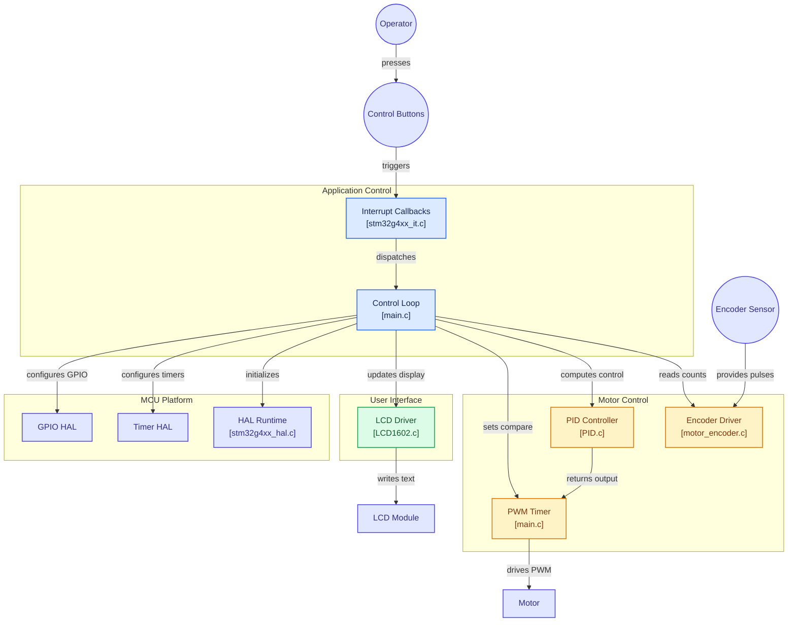

# MotorControlSTM


# MotorControlSTM

Closed-loop DC motor control firmware for the **STM32G431KB**, combining quadrature encoder feedback, a PID control loop, H-bridge PWM motor drive, an LCD1602 user interface, and persistent settings storage in flash.

## Overview

The system reads motor speed/position from a quadrature encoder, runs a PID controller to compute the required output, and drives the motor through an H-bridge via PWM. An LCD1602 display provides real-time feedback to the operator, and control buttons allow runtime adjustment of parameters, which are persisted to flash so they survive power cycles.

## Architecture



## Features

- **Encoder feedback** — quadrature decoding via `motor_encoder.c` for real-time speed/position sensing
- **PID control loop** — configurable PID controller (`PID.c`) computing the motor drive output each cycle
- **H-bridge motor drive** — PWM-based output stage controlling motor direction and speed
- **LCD1602 interface** — live status/parameter display via `LCD1602.c`
- **User input handling** — control buttons dispatched through interrupt callbacks (`stm32g4xx_it.c`)
- **Persistent settings** — parameters stored as records in flash, surviving power cycles

## Hardware

- MCU: STM32G431KB (Nucleo/custom board)
- Quadrature encoder (motor-mounted)
- H-bridge motor driver
- LCD1602 character display
- Push buttons for user input

## Project Structure

```
MotorControlSTM/
├── Core/
│   ├── Inc/                  # Application headers
│   └── Src/
│       ├── main.c            # Control loop, PWM setup, settings management
│       ├── stm32g4xx_it.c    # Interrupt callbacks (button inputs, timers)
│       ├── PID.c             # PID controller implementation
│       ├── motor_encoder.c   # Quadrature encoder driver
│       └── LCD1602.c         # LCD1602 driver
├── Drivers/                  # STM32G4xx HAL and CMSIS drivers
├── Debug/                    # Build output
├── MotorControl.ioc          # STM32CubeMX configuration
└── STM32G431KBTX_FLASH.ld    # Linker script
```

## Roadmap / TODO

- [ ] Tune PID gains
- [ ] Adjust LCD update/refresh rate
- [ ] Define initial system parameters (default settings)

